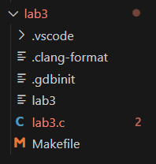
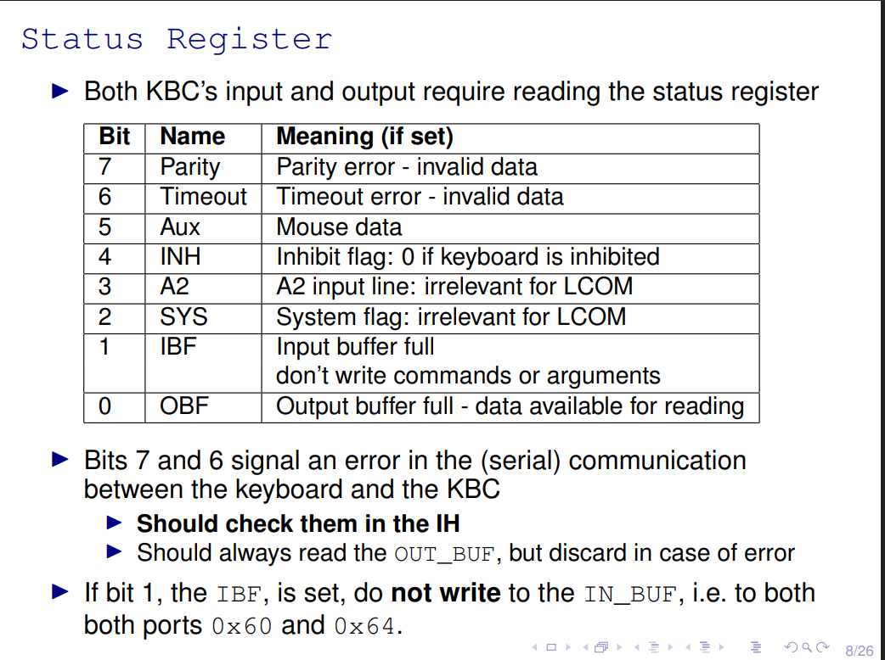
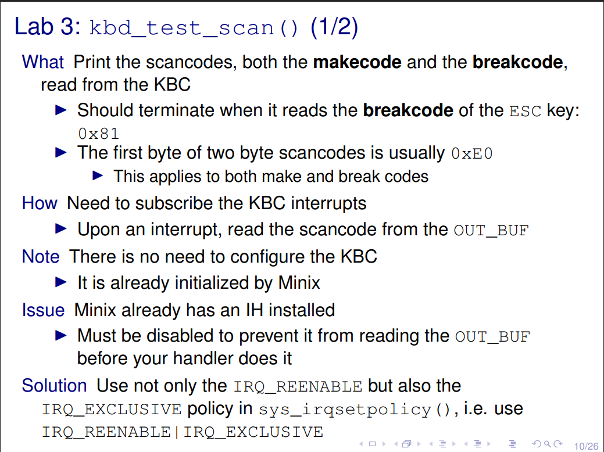
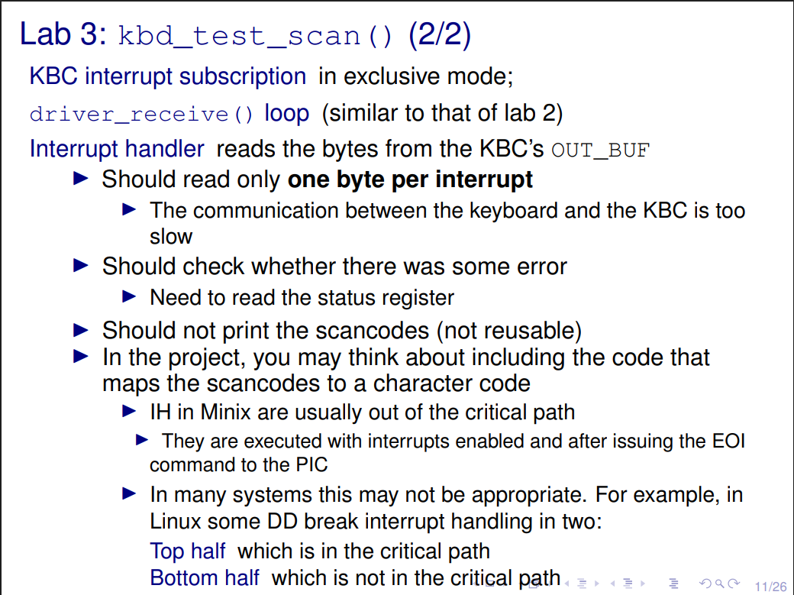
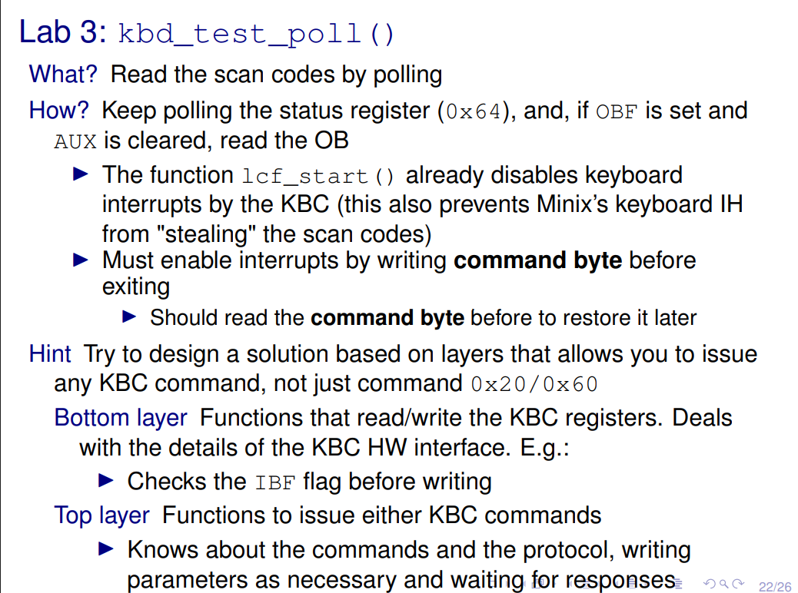
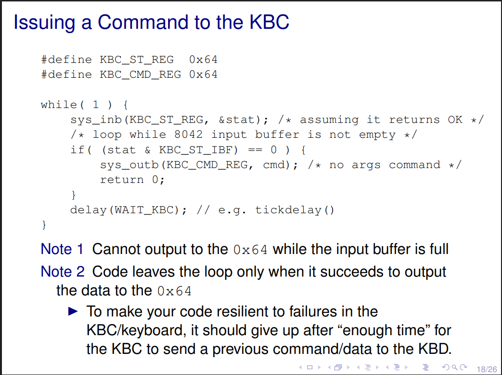
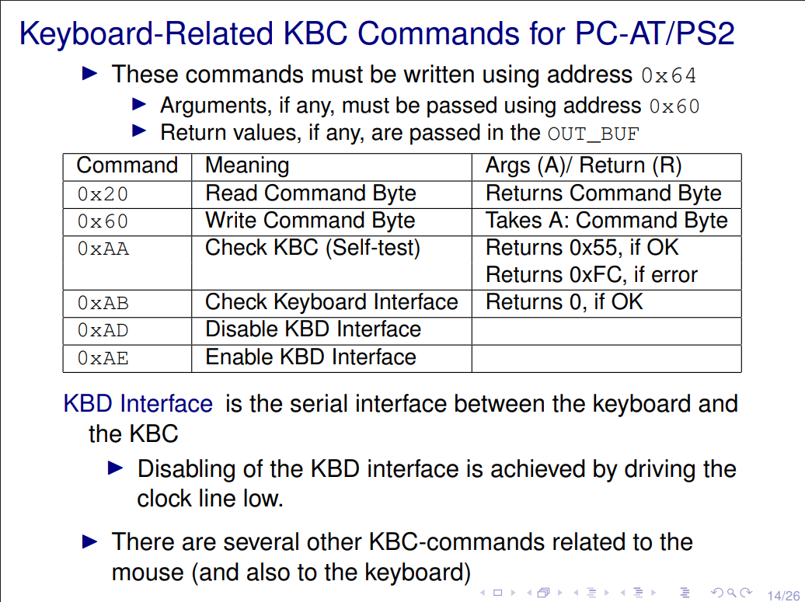

# Lab 3 Keyboard Driver

## Lab Objective

The purpose of this lab is to try to implement the following functionalities:

1. Read and display the scancodes, both the **make codes** and the **break codes**, generated by the PC keyboard via interrupts and via polling;

2. Handle interrupts from more than one **I/O device**


Having that in mind, the following functions will be used to test those functionalities:

1. int kbd_test_scan()
2. int kbd_test_poll()
3. int kbd_test_timed_scan(uint8_t idle)

To have a successful implementation, we first need to study some key concepts that will help understand how the driver works.

## Key ScanCodes

A key **ScanCode**, only depends on the position of the keyboard itself, not the **ASCII** values.

For that reason, different keyboard types such as US and Portuguese, will have different **scancodes**, for the same ASCII value if they are not in the same position in the **keymap**.

There are two types of scancodes:

- **MAKECODE**: Represents the code of a key when its pressed. (E.g Esc make code is 0x01)
- **BREAKCODE**: Represents the code of a key when its released. (E.g Esc break code is 0x81)

Usually, the **breakcode** of a key differs from its **makecode** in the **MSBit**, where its **set** when **released**, and **unset** when pressed.


## KBC (Keyboard Controller)

In modern computers, the comunication between the processor and the keyboard is done via a Controller, the **i8042**. The following links have valueable information about this component.

[IBM 8042 Keyboard Controller](https://t1.daumcdn.net/cfile/tistory/02784B4D50F966F12C)

[Lecture Slides](https://pages.up.pt/~up238172/aulas/lcom2324/at/4kbd.pdf)


## Minix Useful Notes 

When subscribing for the interrupts, have in mind the policies, **IRQ_REENABLE** and **IRQ_EXCLUSIVE**, should be used at the same time.

The keyboard **IRQ is 1**.

The keyboard should respond to a command in under 20ms. For that reason we should set a timeout with that time span, and give enough time for the KBC to respond.

We will utilize the following for this purpose.
```c
#define DELAY_US    20000

tickdelay(micros_to_ticks(DELAY_US));
``` 


## Setting up work environment

To start the lab3 functions we should have the following files.



[lab3.c](https://pages.up.pt/~up238172/aulas/lcom2324/labs/lab3/src/lab3.c)

For the Makefile we can copy the one from lab2 and add ``CPPFLAGS += -pedantic -DLAB3``.

To run the tests from lab3 we can use the command

``lcom_run lab3 ["<list of space separated arguments>"]``

We should also use the ``utils.c`` file created in lab2, and modify the following function.

```c
#define LAB3 // Not needed if flag specified in Makefile
sys_inb(...);
#ifdef LAB3
cnt++;
#endif
```

**IMPORTANT SIDE NOTE**: When needing variables in more than one file, there are two ways to handle that.

```c 
        /* Use extern variable */
extern int kbd_error;
extern uint8_t scancode;
extern int sys_inb_cnt;
```

This makes it so we can access these variables in other file.

Or use a ``getter``.

```c
uint8_t global_kbd_error;
int (get_kbd_error)(uint8_t *kbd_error){
    if(kbd_error == NULL) return 1;
    *kbd_error = global_kbd_error;
    return 0;
}

```

Lastly, probably want to create an ``i8042.h`` file to store important keyboard macros.

## 5.1 kbd_test_scan()

### Function Specifications

Lets get this started then, in the first function our objective is to **read the scancodes** from the **KBC**, using **IH** (Interrupt Handling).

The kbc_ih() should have no arguments, and must do the following:

1. read the status register and check if there was some communication error.
1. read the scancode byte from the output buffer.

After reading the scancode, we can print it using the given function: 

``int kbd_print_scancode(bool make, uint8_t size, uint8_t bytes[])``

- **bool** make: Checks if its a make code or break code.
- **uint8_t** size: Size of the scancode.
- **uint8_t** bytes: array of bytes, that will store the bytes of the scancode.

We should stop the interrupt subscription after reading the breakcode of ``Esc``, **0x81**.

In that sense, we should unsubscribe the interrupt, and print the number of ``sys_inb`` kernel calls, by calling ``int kbd_print_no_sysinb(uint32_t cnt);``.

**uint32_t cnt**: number of calls of sys_inb.

### Function Logic

For this function we will need an interrupt handler. That being said we'll need to create the ``ih loop``, ``keyboard_subscribe``, ``keyboard_ih`` and ``keyboard_unsubscribe``.

How do we do that ?

<details>
  <summary>Answer</summary>
    
```c
    /* Interrupt Subscription */
int (kbd_subscribe_int)(uint8_t *bit_no){
    if (bit_no == NULL) return 1;
    *bit_no = KBD_IRQ;
    if(sys_irqsetpolicy(KBD_IRQ, IRQ_REENABLE | IRQ_EXCLUSIVE, &hook_id_kbd)) return 1;
    return 0;
}
```

```c
    /* Interrupt Unsubscription */
int (kbd_unsubscribe_int)(){
    if(sys_irqrmpolicy(&hook_id_kbd)) return 1;
    return 0;
}
```


  ```c
  int ipc_status;
  message msg;
  int r;
  uint8_t irq_set;
  bool esc_pressed = false;
  if(kbd_subscribe_int(&irq_set)) return 1;

  // Interrupt loop that runs until the ESC key is pressed
  while( !esc_pressed ) { 
     
     if ( (r = driver_receive(ANY, &msg, &ipc_status)) != 0 ) { 
         printf("driver_receive failed with: %d", r);
         continue;
     }
     if (is_ipc_notify(ipc_status)) { 
         switch (_ENDPOINT_P(msg.m_source)) {
             case HARDWARE: 			
                if (msg.m_notify.interrupts & irq_set) { 
                    // Handle keyboard scancodes 
                 }
                 break;
             default:
                 break; 
         }
    } else { 
         
     }
  }

  if(kbd_unsubscribe_int()) return 1;
  return 0;
  ```
</details>


For the body of the irq loop, we will read and write the scancodes, until the user presses ``Esc``, that will trigger the end of the loop.

To read the scancode, for each interrupt, we will read the **OUT_BUF** only one **byte** at a time.

To implement the ``kbd_ih()``:

1. read the status register and check if there was some communications error;
2. read the scancode byte from the output buffer;



How do we do that ?

<details>
    <summary> Answer</summary>

    ```c
    void (kbc_ih)(){
    if(read_kbc_state()) return;
    if(read_out_buf()) return;
    kbd_error = 0;
}

int (read_kbc_state)(){
    kbd_error = 0;
    uint8_t status;
    // Read status register
    if(util_sys_inb(KBC_ST_REG, &status)) return 1;
    
    kbd_error = status & (KBC_PARITY | KBC_TIMEOUT | KBC_AUX);
    // Check if OBF is set (Data available for reading)
    return !(status & KBC_OBF);
}

int (read_out_buf)(){
    if(util_sys_inb(KBC_OUT_BUF, &scancode)) return 1;
    return 0;
}
    ```

</details>

Having crafted our ``kdb_ih``, that handles **errors and reads a scancode** each interrupt call, now we need to check what is the scancode's value.

We know that:

- If its equal to **ESC_BREAK_CODE** then we terminate.
- If its equal to **0x00** then its an invalid scancode.
- If its equal to **0xE0** then its a two byte scancode.

Having that in mind, we should now be able to confortably construct our array of **scancode bytes**, and then print them to the console.





How to do this ?

<details>
    <summary>   Answer  </summary>

    ```c
    if (!kbd_error){
                        
        // Check type of ScanCode
        if(scancode == ESC_BREAK){
            esc_pressed = true;
        }
        if(scancode == INVALID_SCAN_CODE){
            continue;
        }
        if (scancode == TWO_BYTE_CODE){
            isTwoByteScanCode = true;
            continue;
        }
        
        uint8_t size = 1;
        uint8_t bytes[2];

        if (isTwoByteScanCode){
            isTwoByteScanCode = false;
            size = 2;
        }
        // Create array of scancode(s)
        if(create_scancode_array(bytes, size)) return 1;
        // Print to the terminal
        if(kbd_print_scancode(is_make_code(scancode),size,bytes)) return 1;

}
    ```

</details>

Finally we can print the number of ``sys_inb_calls`` made during the whole program, and unsubscribe the keyboard IRQ.

```c
if(kbd_unsubscribe_int()) return 1;
if(kbd_print_no_sysinb(sys_inb_cnt)) return 1;
```

## 5.2 kbd_test_pool()

In this function, we will do the same as the earlier fucntion we saw, but now using a pooling strategy instead of utilizing interrupt handling.

For this function, we should take in mind the following:




- Need to write **command byte**, but first **read it**, and then write it before exiting function.
- Should keep on pooling and check if the **scancode is available for read**(ALREADY DONE THIS IN LAST FUNCTION !!!).

For now lets focus on writting a reusable function to execute commands, in this case the *command byte command*.

How can we achieve this ?

Issue a command (IMPORTANT can be extensible)



Existing commands:



Commands can return or take an argument. Should pass a variable **arg/return** to **use/store** that value.

<details>
    <summary> Answer </summary>

    ```c
    int (issue_kbc_command)(uint8_t cmd, uint8_t *arg_ret_value){
        if (arg_ret_value == NULL) return 1;
        uint8_t status;
        if(util_sys_inb(KBC_ST_REG, &status)) return 1; // Read status register
        if(status & KBC_IBF) return 1; // Check if IBF is set (Input buffer is full)

        // Commands must be written in address 0x64
        // Args need to be passed using address 0x60
        // Return values can be read in the out_buf(0x60) register
        switch (cmd)
        {
        case KBC_READ_CMD:
            if(sys_outb(KBC_CMD_REG,cmd)) return 1;
            if(util_sys_inb(KBC_OUT_BUF,arg_ret_value)) return 1;
            break;
        case KBC_WRITE_CMD:
            if(sys_outb(KBC_CMD_REG,cmd)) return 1;
            if(sys_outb(KBC_CMD_ARG_REG,*arg_ret_value)) return 1;
            break;
        // Other commands can be handled here
        default:
            break;
        }
    return 0;
}
    ```

</details>

Now that we have this function, we should create a wrapper that loops trought it until the command is successfully ran.

How come we do this ?

<details>
    <summary> Answer </summary>

    ```c
    int (loop_over_kbc_command)(uint8_t cmd, uint8_t *arg_ret_value){
        if(arg_ret_value == NULL) return 1;
        
        uint8_t max_tries = MAX_TRIES;
        while (max_tries--)
        {
            if(issue_kbc_command(cmd,arg_ret_value) == 0){
                return 0;
            }
            if(tickdelay(micros_to_ticks(DELAY_US))) return 1;
        }
        return 1;
    }
    ```

</details>

Having these functions will be very useful for later use in the project aswell as this lab.

Now we just need to handle the pooling inside the interrupt loop.