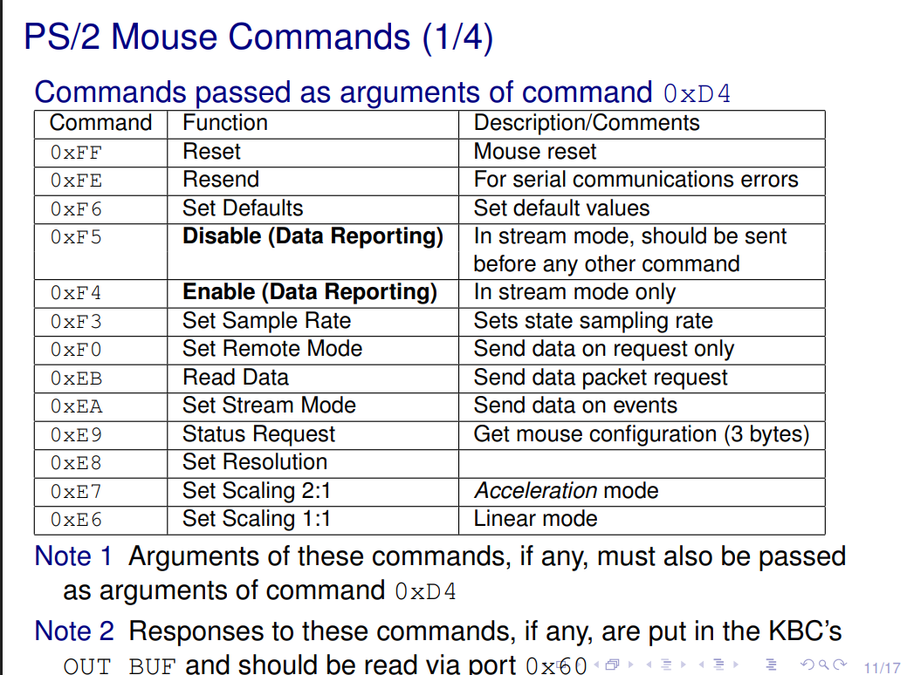
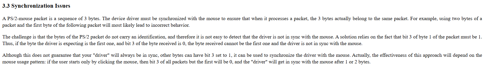
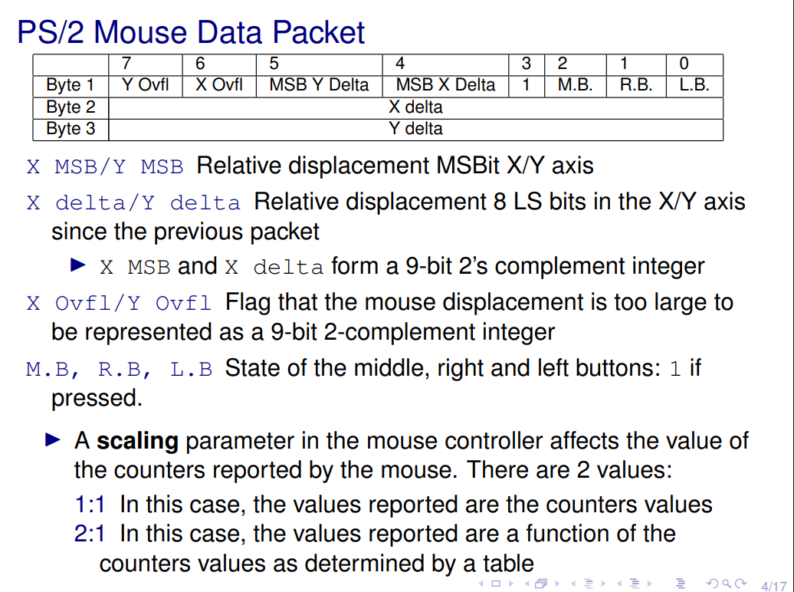

# Lab 4 Mouse Driver

## Lab Objective

1. Read and display the packets sent by the PS/2's mouse in streaming mode
2. Handle interrupts from both the **mouse** and the **timer**
3. Recognize a simple "mouse gesture" using a state machine

In this lab we will need to implement the following functions:

1. int ``mouse_test_packet()``
2. int ``mouse_test_async()``
3. int ``mouse_test_gesture()``

We can get the following lab4 template code from [here](https://pages.up.pt/~up238172/aulas/lcom2324/labs/lab4/src/lab4.c).
Also don't forget to add the ``Makefile`` and also other important files already implemented in the ealier labs.

## Mouse Specifications

To handle the mouse, using a **simple enum**, to handle the mouse state so we know which action is occuring.
For that, we will have to implement the **IRQ loop** to handle the mouse's notifications. Fun fact, the mouse **IRQ LINE is 12**!!

In this lab, the mouse packet size is **3-bytes**, and in the code we will use an array to store that data, aswell as needing to parse some info of those bytes into the ``packet struct``. 

```c
struct packet {
  uint8_t bytes[3]; // mouse packet raw bytes
  bool rb, mb, lb;  // right, middle and left mouse buttons pressed
  int16_t delta_x;  // mouse x-displacement: rightwards is positive
  int16_t delta_y;  // mouse y-displacement: upwards is positive
  bool x_ov, y_ov;  // mouse x-displacement and y-displacement overflows
};
```

This lab will be very similar to the previous one where we had to handle the keyboard via the **KBC**, but now we are going to handle mouse data. 

For that reason I advise a separation of the **KBC functions** in another file so it does not belong to the keyboard or to the mouse its something universal. 

## 5.1 int mouse_test_packet(uint32_t cnt)

How to make this function:

1. configure the mouse properly
1. receive the number of mouse packets specified in its argument via interrupts
1. parse the mouse packets
1. print them in a friendly way
1. reset the mouse to Minix's default configuration, before exiting


Lets focus on the first and second points for now.

To configure the mouse properly, we need to enable the stream mode of the mouse. For that we can use the given function ``mouse_enable_data_reporting()``, or better, we create our own function to handle this.

How can we enable the stream mode then ?

- Similar to keyboard commands however need to check for ACK byte to check if everything went well.
- Mouse commands should have the same register to write commands. In this case we should write the command **0xD4** to port **0x64**, and then again if we pass an argument we should write to port **0x64**, the argument command. 
- Before doing that check if we are able to write, reading the **ST_register** of **KBC** and check if **Input buffer is full**.
- After doing these steps we should now receive an **ACK byte**, that is stored in the **OUT_BUF**, port ``0x60``, and check if we really got the correct byte.

By doing this we get something looking like this:


```c
int (handle_mouse_command)(uint8_t *cmd){
    if(cmd == NULL) return 1;
    
    uint8_t max_tries = MAX_TRIES;
    uint8_t ack_byte = NACK;
    
    while (max_tries--)
    {
        if(loop_over_kbc_command(MOUSE_WRITE_BYTE,cmd) == 0){
            return 0;
        }
        if(tickdelay(micros_to_ticks(DELAY_US))) return 1;
        // READ OUT_BUF ACK byte
        if (util_sys_inb(KBC_OUT_BUF,&ack_byte)) return 1;
        if (ack_byte == ACK) return 0;
    }
    return 1;
}
```



And we should pass to the function the cmd we are going to use. In this case it will be **enabling and disabling the stream mode**.

Now we have to parse the packets and then print them in a friendly way using the already give function ``void mouse_print_packet(struct packet *pp);``

How can we do that ?
Same thing as we did with keyboard, read one byte for each interrupt, and when we have all three necessary bytes we can print them.
That being said, let us implement the ``mouse_ih``, that should look very similar to the ``kbd_ih``.

```c
void (mouse_ih)(){
    if(read_kbc_state(1)) return;
    if(read_out_buf()) return;
    mouse_error = 0;
}
```
We will have the same structure as before, reusing ``read_kbc_state``, but now with an input that will tell if mouse data is being received or not. This will be good for future development as we can then use this same function to handle ``kbc errors``. 

If there are no errors, we can store this byte on our packet, however we need to be careful so we are in sync with the mouse packets being received, so that there won't me a missmatch on the bytes' order.

How can we do that ?



To check if we are handling the first byte, it says we should check if the third bit is set. We cannot be 100% sure that it will have the behaviour we want, but it should be enough.

So for that reason we only need to check if that bit is set. If it is and our **byte_index is 0**, then we are on the first byte of the **packet**, if not we are handling one of the other two.

```c
int (handle_byte_sinc)(uint8_t *byte_index){
    if (byte_index == NULL) return 1;

    if ((current_byte & BIT(3)) && *byte_index == 0){
        *byte_index = 1;
        pp.bytes[0] = current_byte;
        return 0;
    } else if (*byte_index > 0){
        pp.bytes[*byte_index] = current_byte;
        *byte_index = (*byte_index + 1);
        return 0;
    }
    
    return 1;
}
```

Now that we are constructing our packet, when we reach the **last byte**(third one), we should **parse the bytes' info** and then print out the packet.

How do we do that ?

- Need to extract impotant bits from **first byte**.
- Depending on the value of **MSB Y Delta** and **MSB X Delta**, if its **not set**, it means the 9 bit number will be positive, if it is **set** ,however, the number will be a two's complement negative number. (This number has sign)



```c
void (parse_packet)(){
    pp.lb = pp.bytes[0] & BIT(0);
    pp.rb = pp.bytes[0] & BIT(1);
    pp.mb = pp.bytes[0] & BIT(2);
    pp.delta_x = (pp.bytes[0] & BIT(4)) ? pp.bytes[1] | 0xFF00 : pp.bytes[1];
    pp.delta_y = (pp.bytes[0] & BIT(5)) ? pp.bytes[2] | 0xFF00 : pp.bytes[2];
    pp.x_ov = pp.bytes[0] & BIT(6);
    pp.y_ov = pp.bytes[0] & BIT(7);
}
```

After parsing the info, we just need to print the packet using the function given to us.

```c
if (num_byte == 3){
    parse_packet();
    struct packet pp;
    if (get_packet(&pp))
        return 1;
    mouse_print_packet(&pp);
    num_byte = 0;
    cnt--;
    }
```

And we are basically done. Now we just need to unsubscribe and disable the ``stream mode``.

```c
if (mouse_unsubscribe_int())
    return 1;

  if (mouse_disable_data_report())
    return 1;
```

## 5.2 mouse_test_async(uint8_t idle_time)
