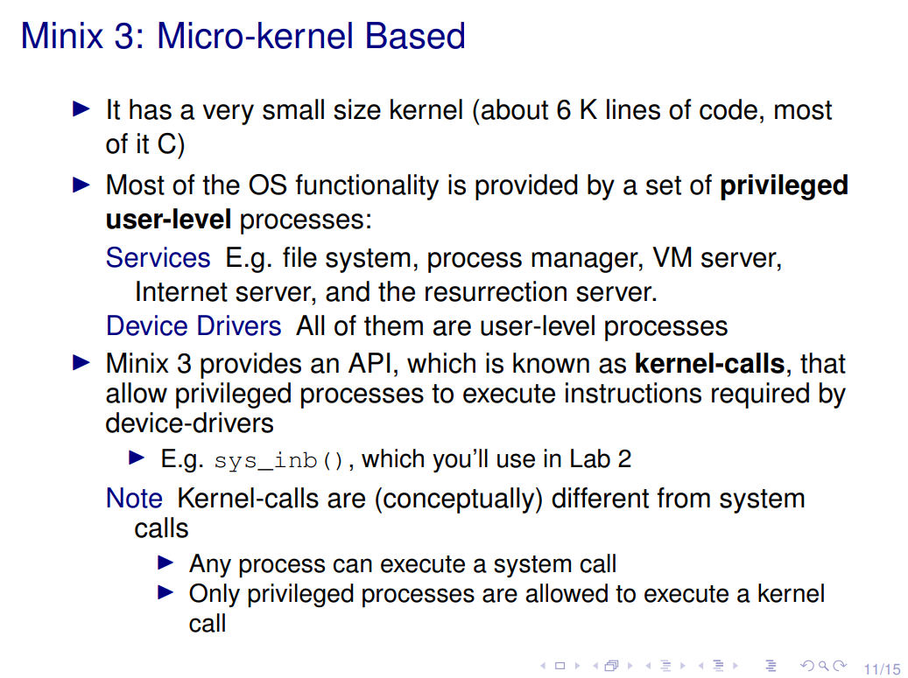
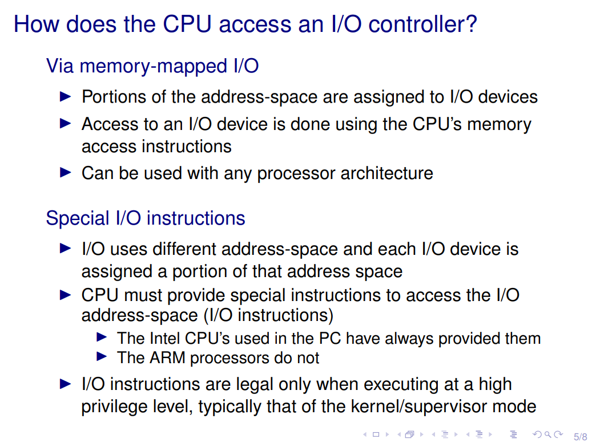

# Soluções teste 1 

## Questão 1

Em Minix, ambiente que usou nas aulas de LCOM, utilizamos funções especiais
para interagir com os dispositivos de I/O do sistema. O que fazem estas funções?

- Resposta **D**: Certos espaços de memória são reservados para mapear o endereço dos I/O components, para não haver acesso direto, devido a riscos de segurança. 

## Questão 2

- Resposta **C**: Ao nível do utilizador.

## Questão 3

- Resposta **D**: 0xE em bits = 1110. Ao fazer um shift **>> 1** obtemos **0xE >> 1 = 0111**.

## Questão 4

- Resposta **D**: 

## Questão 5

- Resposta **A**:

## Questão 6

- Resposta **D**: