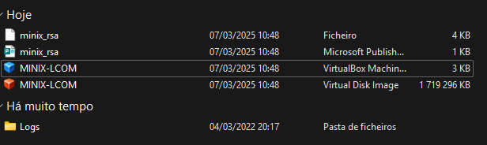
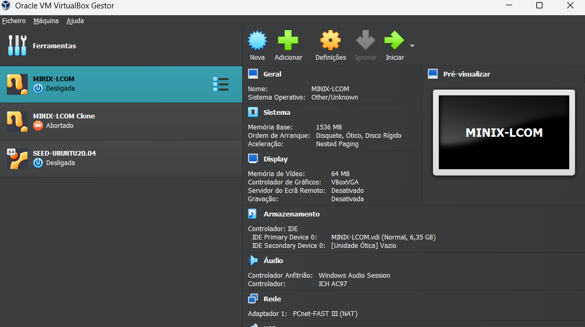
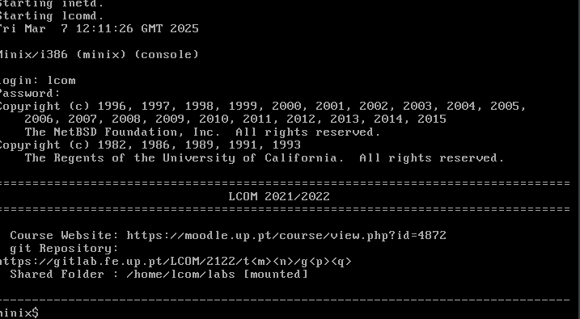
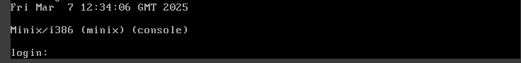

# LAB 0 (MINIX INSTALATION)

## Guide To Install Minix

To **install minix virtual box** follow these steps:

1. Go to [Virtual Box Website](https://www.virtualbox.org/wiki/Downloads) and install the program with your computer's arquitecture
2. Download the zipped VM Image given [VM Minix Zip](https://drive.google.com/file/d/1dM32zTzkTUEqNtTwsO-n__XO6r1Y5I-f/view)
3. After Downloading the Zipped Content and unzipping it, Click on the blue icon that says **MINIX-LCOM**

This should lead you to this interface:


So that your VM can have access to folders from your pc you need to do these steps:
1. Create a folder with any given name (e.g. shared) in the same directory as the Downloaded content.
2. Click on the wheal icon where it says (definições)
3. Now go to where it says shared folders and link the folder you created just now
4. Start your VM and check if the mount was successfull.
Should appear **Shared Folder Mounted**.


If **unable to boot up Minix**, check these notes: 

- If after setting up VirtualBox as described above you are unable to boot Minix, you may need to enable Intel's VT-x, i.e. [Intel's hardware virtualization instructions, in your computer's BIOS/UEFI](https://www.howtogeek.com/213795/how-to-enable-intel-vt-x-in-your-computers-bios-or-uefi-firmware/).
- If you have installed Linux in dual-boot with Windows and you are unable to boot, [you may need to disable secure boot in your computer's BIOS/UEFI](https://www.howtogeek.com/116569/htg-explains-how-windows-8s-secure-boot-feature-works-what-it-means-for-linux/).


## Loggin In to Minix VM

To log in into MINIX-Acounts you can use two accounts:

- Normal user account: **lcom**.
- system admin account, **root**.
- Both accounts have the same password: **lcom**.
  
As default use the normal user account.

Login Interface 



## Working Env + Git configuration

To use your favourite IDE with minix console just type this command in your console:
```bash
$ ssh lcom@127.0.0.1 -p 2222
```
Minix console has many limitations so its better to use an outside console or an IDE.

To clone your git repository of your group, go to the path where your shared folder is and clone your repo.

```bash
$ git clone <git_remote_repos_url> shared
```

After doing that, git can ask you about your info. If thats the case type this.
```bash
$ git config user.name "<Your first and last names, at least>"
$ git config user.email "<Your email>"
```
**Do not forget** to create your ssh key if you do not have one. To clone your repo you need to have the **FEUP VPN** on.

To run a program you just need to compile it and run it just as you would in **C** !!!

I advise you to create a **MAKEFILE**, for an easier conduct.


# C Standards and Introduction


## Arguments

In C languague we can pass parameters as inputs to the program, utilizing ``argc`` and ``argv``.

Fuction main should look like the following:

```c
#include <stdio.h>
int main(int argc, char *argv[])
{
  printf("argc: %d\n", argc);
  printf("argv: %s\n", argv[0]);
  return 0;
}
```

``argc`` - is a value **int** that indicates the number of arguments passed to the program.

``argv`` - is an array of pointers for each argument passed in the command.

Now lets look at this example:

```c
#include <stdio.h>
int main(int argc, char *argv[])
{
  int i = 1;
  for (i; i < argc; i++)
    printf("%d Parameter: %s\n", i, argv[i]);
  return  0;
}
```

We compile the program with this command:
```bash
minix$ cc -Wall arguments.c -o arguments
minix$ ./arguments ARG1 ARG2
```

What do you think the expected value is ?

<details>
  <summary>Answer</summary>
  1 Parameter: ARG1
  
  2 Parameter: ARG2
</details>


Why did this happen ? 

Thing is when running ```./arguments ARG1 ARG2``` argv takes as inputs these strings ["./arguments", "ARG1" ,"ARG2"] and ``argc`` stores the number of arguments, in this case **3**.  

Now lets look at this example:

```c
#include <stdio.h>
#include <stdlib.h>
#include <string.h>
int main(int argc, char *argv[])
{
  if(!(argv[1][0] == '0' || atoi(argv[1]))){
    printf("This is not a number\n");
    return 1;
  }
  int value;
  value = atoi(argv[1]);
  printf("Read Value: %d\n", value);
  return 0;
}
```

In this program we are trying to convert a string to a number using the function ``atoi`` (ASCII to Integer) imported from the ``#include <stdlib.h>`` library. If an error ocurrs the function will return 0.

What is the problem with this code ?

```bash
minix$ cc -Wall string_to_int.c -o string_to_int
minix$ ./string_to_int 0
```

<details>
  <summary>Answer</summary>
  With input <strong>./string_to_int 0fakdsfjl</strong> there is no error warning.
</details>

Remember in **C**, strings end with ``'\0'``.
For this problem we need to use ``strlen``, to check if the input is a '0' instead of '0afajf'.
```
// This "0" is equal to this "0\0"
// strlen("0") is equal to 1; We do not count the "0\0"
// We cannot compare strings using equals; "0" == argv[1] Is incorrect
// Comparison should be made byte per byte
```


<details>
  <summary>Code Answer</summary>
  <pre><code class="language-c">
    #include &lt;stdio.h&gt;
    #include &lt;stdlib.h&gt;
    #include &lt;string.h&gt;
    int main(int argc, char *argv[]) {
        if (!((argv[1][0] == '0' && strlen(argv[1]) == 1) || atoi(argv[1]))) {
            printf("This is not a number\n");
            return 1;
        }
        int value;
        value = atoi(argv[1]);
        printf("Read Value: %d\n", value);
        return 0;
    }
  </code></pre>
</details>

## Masks

**Always have in mind the size of the variable you are using**:

Lets see this example:

```c
#include <stdio.h>

int main(int argc, char *argv[])
{
  unsigned char a; // 8 bits; 1 byte

  // definir o valor inicial de c
  a = 255;  // 11111111 = (0xff)
  printf("a: %d (%x)\n", a, a);
  a+=1; // ????
  printf("a: %d (%x)\n", a, a);

  char b;
  b = 127; // 01111111
  printf("b: %d (%x)\n", b, b);

  b+=1; // ????
  printf("b: %d (%x)\n", b, b);

  return 0;
}
```

What is the expected output ??

<details>
  <summary>Answer</summary><pre>
  a: 255 (0xff)
  a: 0 (0) // overflow occurs
  b: 127 (0x7f) 
  b: -128 (ffffff80) // overflow occurs 10000000 (first bit is used for the sign part) (revert all bits and add one)
  <pre>
</details>


Be aware of the size of each declared variable, while a is an unsigned char, varying from ``0 - 255``, a (signed) char ranges from ``-128 - 127``. 

Some useful bitwise operations:

### AND &

```
  0011 1000
& 1010 1001
-------------
  0010 1000
```

### OR |

```
 0011 1000
| 1010 1001
-------------
  1011 1001
```

### XOR ^

```
  0011 1000
^ 1010 1001
-------------
  1001 0001
```

Some useful situations:

Check parity of a number:

```c
// Return 0 -> number is even
// Return 1 -> number is odd
int is_odd_v1(const char number) {
    return number % 2;
}
```

Using bitwise operation

<details>
  <summary>Answer</summary><pre>
// is odd if last bit is 1
// is even if last bit is 0
// Use mask 1 = 0000 0001 (result will be either 0 or 1 if last bit is active)
int is_odd_v2(const char number) {
    return number & 1;
}
  <pre>
</details>


## Macros

Useful for code structuring and improve its readability. Macros substitute string names to a certain value. By convention, consider utilizing uppercase letters when declaring a macro.

Example:

```c
#define TRUE    1
#define FALSE   0

int bigger_than(const char a, const char b)
{
  if (a > b)
    return TRUE;
  return FALSE;
}
```

In LCOM, the usage of the following ``BIT`` macro will be very useful to active a certain Bit.

```c
// BIT(0) = 0b00000001 = 1
// BIT(1) = 0b00000010 = 2
// BIT(2) = 0b00000100 = 4
// ...
#define BIT(N) (1 << (N))
```

## Shifts

Now lets look at bit shifting. In C there are two operators of shifting:

- left shifting: (value) << n, here we are shifting ``value``, n times to the left.
- right shifting : (value) >> n, here we are shifting ``value``, n times to the right.

When shifting bits, if you go above the size of the value, related to the bits current position, that active bit will be lost. Have in mind that a left shift by **n** times, is equal to multiplying **2^n** times your value. If you do a left shift, you are diving the value by **2^n**.


Lets look at an example ``shift.c``:


```c
#define SHIFT(val,n) (val << (n))
#include <stdio.h>
int main(int argc, char *argv[])
{
  char val = 8; // 0000 1000
  int n = 2; // number of shifts
  
  char newVal = SHIFT(val,n); // same as *2^n, 8 * 2^2 = 32

  printf("Value is %d\n", newVal);
  printf("Value in hexa 0x%x\n", newVal); // 0010 0000

  newVal = SHIFT(newVal,3);

  printf("Value is %d\n", newVal); // 0
  printf("Value in hexa 0x%x\n", newVal); // 0000 0000 Exceeded the number of bits
  return 0;
}

```