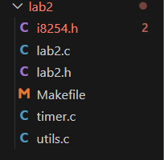
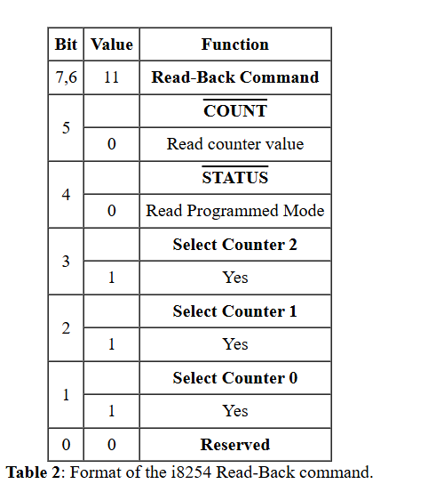
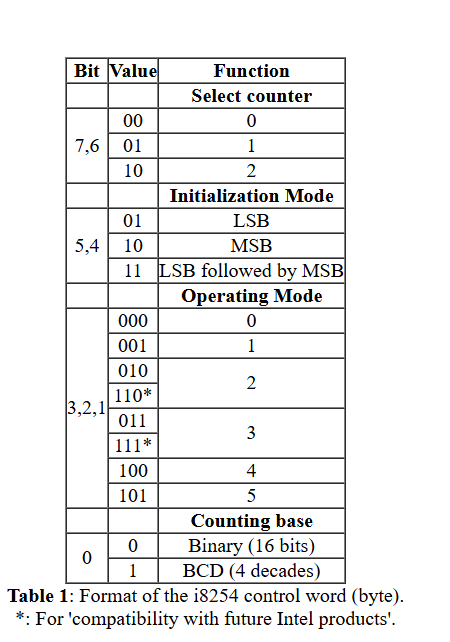
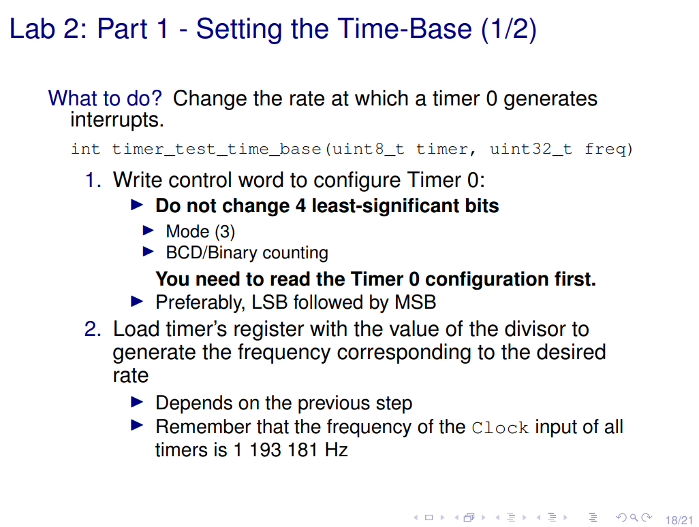
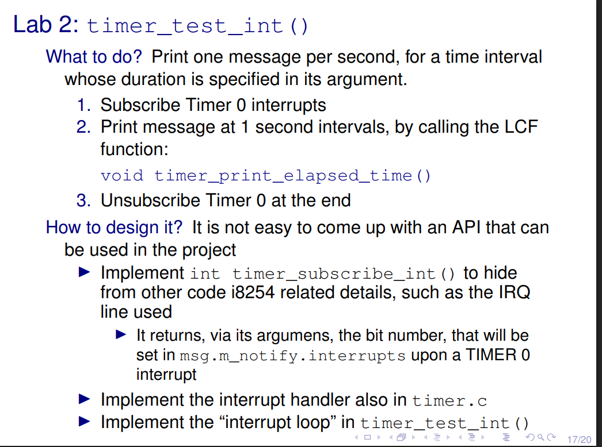
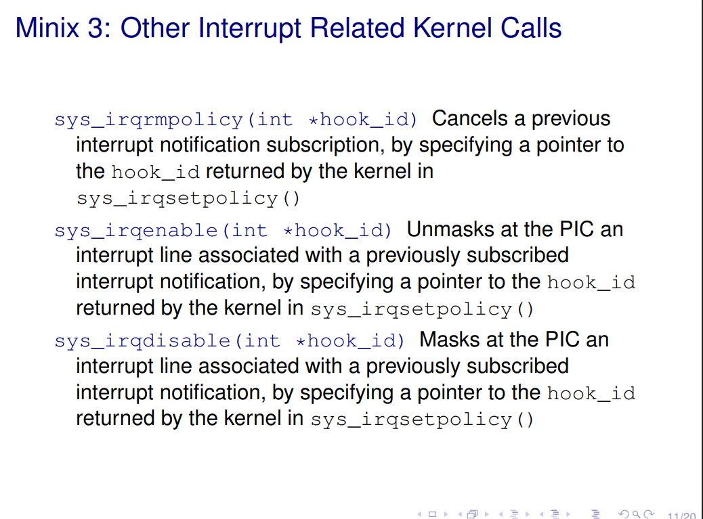
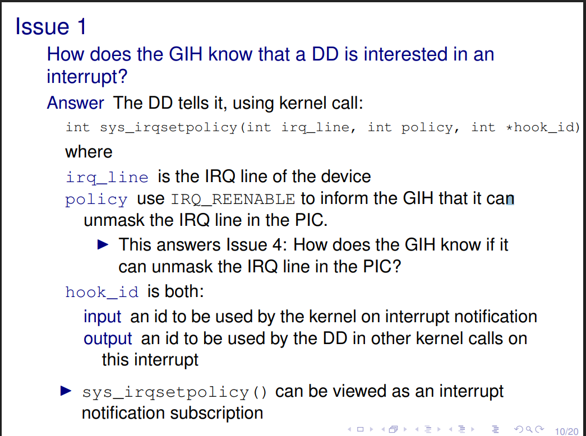

# LAB 2 Timer Driver

Ok lets start off by unzipping the content given. We should have something looking like this:



Before starting the big functions lets setup some useful small functions to help us keep a good code structer.
Looking at the ``i8254.h`` we can see some important ``macros``, that will later be used. We can start by inserting the most important macro: ``#define BIT(N) (1 << (N))``.


Next up lets look at ``utils.c``.

Lets start by setting up those functions:

<details>
  <summary>Functions Made</summary>

```c
int util_get_LSB(uint16_t val, uint8_t *lsb) {
    if(lsb == NULL) return 1;
    *lsb = val;
    return 0;
}

int util_get_MSB(uint16_t val, uint8_t *msb) {
    if(msb == NULL) return 1;
    *msb = val >> 8;
    return 0;
}
// Reads the value of a 8-bit register from a given port
int util_sys_inb(int port, uint8_t *value) {
    if (value == NULL) return 1;
    uint32_t val;
    int ret = sys_inb(port, &val);
    *value = val;
    return ret;
}

// Writes a value to a 8-bit register from a given port (No need to use this)
int (util_sys_outb)(int port, uint8_t *command) {
  if (command == NULL) return 1;
  int ret = sys_outb(port, *command);
  return ret;
}
```
</details>


After thats done lets do the function ``timer_test_read_config``  and start the real deal.

Go to and read
[Section 3.3 of Lab2](https://pages.up.pt/~up238172/aulas/lcom2324/labs/lab2/lab2_03.html#tab2) and also check 
[Slides of class](https://pages.up.pt/~up238172/aulas/lcom2324/at/2timer.pdf).

Steps to read a timer's configuration:

- Write the ``read-back-command`` to the **Control Register**.
- Read the timer port.

After that we can read and write the timer's configuration using ``timer_display_conf()`` and then call ``timer_print_config()``.

- Check timer_status_field enum
- For each type of field different actions shall be made
- Check how the timer config works 

To test the function just need to run:

- ``lcom_run lab2 "config <decimal no. - timer> all|init|mode|base"``

<details>
  <summary>Functions Made</summary>

```c
#define TIMER_OPERATING_MODE    (BIT(3) | BIT(2) | BIT(1))  // Create this macro

int(timer_test_read_config)(uint8_t timer, enum timer_status_field field) {
  uint8_t st;
  if (timer_get_conf(timer, &st))
    return 1;
  
  if(timer_display_conf(timer, st, field)) return 1;

  return 0;
}


int (timer_get_conf)(uint8_t timer, uint8_t *st) {

  uint8_t read_back_command = TIMER_RB_CMD | TIMER_RB_COUNT_ | TIMER_RB_SEL(timer);
  if (sys_outb(TIMER_CTRL, read_back_command))
    return 1;
  
  if(util_sys_inb(TIMER_0 + timer, st))
    return 1;

  return 0;
}


int (timer_display_conf)(uint8_t timer, uint8_t st,
                        enum timer_status_field field) {

  union timer_status_field_val status_field_val;

  switch (field) {
    case tsf_all:
      status_field_val.byte = st;
      break;
    case tsf_initial:
      status_field_val.in_mode = (st & TIMER_LSB_MSB) >> 4;
      break;
    case tsf_mode:
      status_field_val.count_mode = (st & TIMER_OPERATING_MODE) >> 1;
      if(status_field_val.count_mode == 6 || status_field_val.count_mode == 7) status_field_val.count_mode -= 4;
      break;
    case tsf_base:
      status_field_val.bcd = st & TIMER_BCD;
      break;
    default:
      return 1;

  }
  
  if(timer_print_config(timer, field, status_field_val)) return 1;

  return 0;
}
```
Read Back Command to be written



Timer Output status


</details>


The next function we are going to implement is ``timer_test_time_base()``. For this section we will only need to implement ``timer_set_frequency()``.


How do we set the frequency of the timer ?

<details>
  <summary>Answer</summary>

```c
int (timer_set_frequency)(uint8_t timer, uint32_t freq) {

  if (freq < 19 || freq > TIMER_FREQ) {
    printf("Invalid frequency\n");
    return 1;
  }

  uint8_t st;
  if (timer_get_conf(timer, &st))
    return 1;
  // Create the control word
  uint8_t control_word = ((TIMER_SEL0 + timer) << 6) | ((st << 4) >> 4) | TIMER_LSB_MSB;

  // Write control word to the control register

  if(sys_outb(TIMER_CTRL, control_word))
    return 1;


  // Load the divisor to the timer register
  uint16_t divisor = TIMER_FREQ / freq;
  uint8_t lsb, msb;
  // Get the LSB and MSB of the divisor
  if(util_get_LSB(divisor, &lsb) || util_get_MSB(divisor, &msb))
      return 1;
  
  // Write the LSB and MSB to the timer register (ORDER MATTERS) 
  if(sys_outb(TIMER_0 + timer, lsb) || sys_outb(TIMER_0 + timer, msb))
        return 1;

  return 0;
}
```


</details>


Finally we are close to the end, now we just need to implement ``timer_test_int()``. This functions aims for us to learn how interrupts work. In this case we will only handle the timer's interrupt.


Here is what we need to know:




We will need to use this:

```c
 #include <lcom/lcf.h>
 
int ipc_status;
  message msg;
  int r;
  uint8_t irq_set = 0;
  while( 1 ) { /* You may want to use a different condition */
     /* Get a request message. */
     if ( (r = driver_receive(ANY, &msg, &ipc_status)) != 0 ) { 
         printf("driver_receive failed with: %d", r);
         continue;
     }
     if (is_ipc_notify(ipc_status)) { /* received notification */
         switch (_ENDPOINT_P(msg.m_source)) {
             case HARDWARE: /* hardware interrupt notification */				
                if (msg.m_notify.interrupts & irq_set) { /* subscribed interrupt */
                        /* process it */
                 }
                 break;
             default:
                 break; /* no other notifications expected: do nothing */	
         }
    } else { /* received a standard message, not a notification */
         /* no standard messages expected: do nothing */
     }
  }
```

Basically what we are doing here is awaiting for a message of the timer to trigger, and we need to catch it. The timer for example, can set an alarm to trigger in one second, and we need to catch that and possibly do an action/stop the program.

How can we achieve this then ?

Need to create subscription functions for the timer.




How to do it:




<details>
  <summary>Answer</summary>

```c
int (timer_subscribe_int)(uint8_t *bit_no) {
  if(bit_no == NULL) return 1;
  *bit_no = BIT(hook_id); // This value will change after setting the policy
  if(sys_irqsetpolicy(TIMER0_IRQ, IRQ_REENABLE, &hook_id) != OK) // Set correct policy
    return 1;

  return 0;
}

int (timer_unsubscribe_int)() {
  if(sys_irqrmpolicy(&hook_id) != OK) // Remove the policy
    return 1;
  return 0;
}
```

</details>


Next up, we will need to handle the time that has passed until now inside the interrupt loop.

For that we will need to have in atention certain details,
when subscribing the timer, we will have to store an unique **hook_id**. This id will be useful to when checking if there has been a timer interrupt using a mask, **irq_set**.
Finally some additional notes. The timer's default freq is 60, meaning that in one second there will be 60 interrupts. For that reason we keep the number of interrupts that happened, so that we can check how much time has passed. Utilizing ``timer_counter``.


```c

extern int timer_counter;

int(timer_test_int)(uint8_t time) {
  
  int ipc_status;
  message msg;
  int r;
  uint8_t irq_set;

  if(timer_subscribe_int(&irq_set)) return 1;

  // Interrupt loop that runs until the time is over
  while( time ) { 
     
     if ( (r = driver_receive(ANY, &msg, &ipc_status)) != 0 ) { 
         printf("driver_receive failed with: %d", r);
         continue;
     }
     if (is_ipc_notify(ipc_status)) { 
         switch (_ENDPOINT_P(msg.m_source)) {
             case HARDWARE: 			
                if (msg.m_notify.interrupts & irq_set) { 
                  timer_int_handler();
                  // Default number of timer ticks per second is 60 so when the counter reaches 60, 1 second has passed 
                  if(timer_counter % 60 == 0){
                    timer_print_elapsed_time(); // Will print time
                    time--;
                  }
                 }
                 break;
             default:
                 break; 
         }
    } else { 
         
     }
  }

  if(timer_unsubscribe_int()) return 1;
  return 0;
}
```

```c
int hook_id = 0; // Timer hook_id needs to be unique
int timer_counter = 0; // Timer counter needs to be global

void (timer_int_handler)() {
  timer_counter++;
}
```